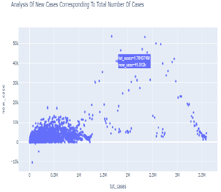

# Data Science Projects Portfolio

# [Project 1:Factors-affecting-Covid-19](https://github.com/neil996/Factors-affecting-Covid-19)

* The project aims to generalize the effects of Novel coronavirus across different counties in United States Of America and moreover discuss various different factors affecting the same. We have taken into account multiple age factors which are getting affected due to the virus and moreover takes into account different condition factors. The project looks to find distinct and diverse factors in various age groups, i.e. how they are impacting Covid deaths and cases across various regions in United States. The domain of the datasets is related to health care as discussed above the project aims to identify the impact of Covid. The datasets have been selected to take into account all these factors so as to combine diverse factors to get a generalized sense from the available data. The data is obtained mainly from Centre for Disease Control and Prevention which is Federal organization collecting data on daily or random basis as per their availability, moreover as per their description states and local authorities reports the cases regularly to keep the data up to date.

# Data Pre-processing

* To analyze the Null values in a more quantitative and generalized manner, we use different packages such as naniar which can give the number of missing values by plotting it and thus giving us a visualization to get more insights,fig. shows the implementation of naniar package

  
  
* VIM (Visualization and Imputation of Missing Values) package helps to visualize the missing data in a deep way and thus can help to apply specific mechanisms which can be helpful in analyzing the missing values and deciding whether to impute/replace or remove it, while Fig Shows the implementation of VIM package.

  

* Regression Techniques Implemented:

1.	XGBoost
2.	Random Forest
3.	Multiple Linear Regression
4.	Decision Tree

* Classification Models Implemented:

1.	KNN(K-Nearest Neighbor)
2.	SVC(Support Vector Classification)

# [Project 2:Time series analysis](https://github.com/neil996/Time_Series_Analysis)

Analysis of different time series models on OverseasTrips and NewHouseRegistrations in Ireland.
Th project makes use of different time series analysis models such as ARIMA, Naive, Simple Exponential Model, etc. Below is a short description of data set and how it is analyzed for a time series model.

# OverseasTrips Dataset

* The Overseas Trips dataset is obtained from Central Statistics Office in Ireland and is a quarterly time series data indicating travel by non-residents to Ireland from Q1. 2012 to Q4, 2019.
In this section, we will analyze the raw time series of the dataset which is also the required step in every time series modeling process. As the raw time series helps to identify the
Trends or Seasonality patterns within the data, which we can take into consideration during the execution of the models.

* Firstly the dataset extracted, is converted to a time series model using the function ts(), where the start and end is given along with the frequency and as this is a quarterly dataset, we given the frequency as 4. Moving on we plot the data using 
the function plot for which the output obtained is shown below in Fig. 1. ,which shows that there is increasing trend in the data as we move along from 2012 to 2020 moreover the plot also
indicates the presence of seasonality which although remains constant for most time but also show spikes as the years progresses.:

 
 
 
# [Project 3:Analyzing Covid-19 Deaths in Patients with Different Conditions among Various Counties in the United States of America](https://github.com/neil996/Database-and-analsytics-programming)

As a group project comprising of 2 team memebers, this repository presents the work done by me, moreover there are 2 Jupyter Notebooks uploaded, and it contains analysis performed on Coivd-19 using Pandas dataframes, numpy, regression techniques and No-SQL databases design. The datasets has been acquired from CDC though Socrata API, and retreived in python by using limit parameter. Please clcik on the highlighted link to move to the particular repository and get more insights.)

Below is the abstract, detailing about the problem faced and how it will be tackeled thorugh this research.

* Since the spread of Covid-19 virus which has impacted the whole world, dislodging some of the world’s biggest economies to the bottom with no exception of the United States of America, the death rates across America spiked at a tremendous rate therefore causing tremendous loss of life. Thus such an impact around the world has been a motivation for the research, so as to evaluate the covid-19 mortality among various counties with patients suffering under various conditions such as some patients have septic, influenza and many other moreover finding the probable cases so as to predict the mortality rates of the region, which can help the counties to take measures to avoid such an outcome.

* The study aims to analyze various patients’ under different categories of their respective health status. The research in the topic helped to generalize the data in a more efficient manner so as to analyze the Covid deaths across various counties moreover exploring new insights in the hidden data such as number of probable deaths, new cases, updated probable deaths, identifying different age groups and their corresponding symptoms.

* Scatter plot:

 

* Pie chart showing patients with different conditions affected by covi-19

 

* Bar chart showing Probable vs. Confirmed cases

 

